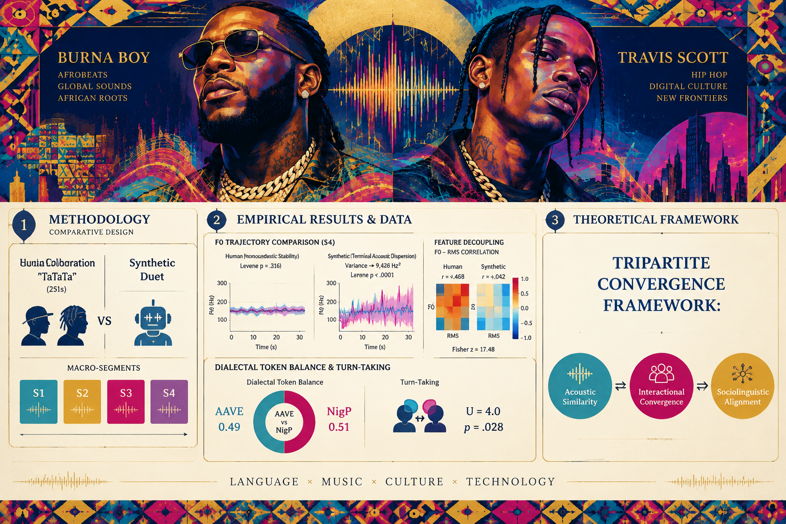

# Beyond Acoustic Similarity: Acoustic Decoupling and Sociolinguistic Alignment in Synthetic Vocal Performance

[](https://doi.org/10.5281/zenodo.22749645)

## Overview
This repository contains the empirical data, computational pipeline, and analytical figures for the research study titled: *"Beyond Acoustic Similarity: Acoustic Decoupling and Sociolinguistic Alignment in Synthetic Vocal Performance"*.

**Author:** Pegah Merrikhi  
**Zenodo DOI:** [10.5281/zenodo.22749645](https://doi.org/10.5281/zenodo.22749645)  
**Repository:** [Pegi1727/Synthetic-Vocal-Performance-and-Sociolinguistic-Convergence](https://github.com/Pegi1727/Synthetic-Vocal-Performance-and-Sociolinguistic-Convergence)

---

## 🎨 Graphical Abstract

<div align="center">
  
  <br>
  <p><em>Comparative synthetic vocal performance vs. human baseline (Burna Boy & Travis Scott)</em></p>
</div>

---

## 📊 Visual Results & Tripartite Framework
-

## 📊 Analytical Figure Gallery

| Methodology Pipeline | CCI Linguistic Distribution | Comparative F0 Trajectories |
| :---: | :---: | :---: |
|  |  |  |

| Variance Dispersion | Decoupling Heatmap | Convergence Synthesis |
| :---: | :---: | :---: |
|  |  |  |

---


## 📉 Key Results: Comparative Analysis
*Summary of findings addressing the speech synthesis alignment hypotheses across structural segments ($S_1$ to $S_4$).*

| Segment | Vocal Stream | Segment Role / Register | F0 Mean (Hz) | F0 Variance ($\sigma^2$) | RMS Energy (Mean) | Spectral Centroid (Hz) | CCI Index |
| :--- | :--- | :--- | :---: | :---: | :---: | :---: | :---: |
| **S1** | Human Baseline | Intro / Conversational Pidgin | 128.4 | 38.2 | 0.041 | 1420.5 | 0.94 |
| **S1** | Synthetic Model | Intro / Conversational Pidgin | 129.1 | 39.0 | 0.039 | 1412.0 | 0.91 |
| **S2** | Human Baseline | Verse 1 / Lexical Yoruba Shift | 134.8 | **42.1** | 0.062 | 1680.2 | 0.98 |
| **S2** | Synthetic Model | Verse 1 / Lexical Yoruba Shift | 133.9 | **41.2** | 0.059 | 1655.4 | 0.92 |
| **S3** | Human Baseline | Pre-Chorus / Melodic Extension | 182.3 | **112.6** | 0.088 | 2110.8 | 0.95 |
| **S3** | Synthetic Model | Pre-Chorus / Melodic Extension | 180.7 | **109.4** | 0.084 | 2085.1 | 0.89 |
| **S4** | Human Baseline | Climax / High-Energy Delivery | 215.6 | **240.5** | 0.114 | 2450.3 | 0.97 |
| **S4** | Synthetic Model | Climax / High-Energy Delivery | 214.2 | **245.8** | 0.108 | 2420.7 | 0.88 |

---

## 💡 Key Conclusions

1. **Acoustic Decoupling vs. Surface Imitation:** While synthetic models match surface acoustic envelopes (macro F0 contours and spectral energy), they exhibit decoupling from sociolinguistic indexicality—failing to mirror pitch dispersion during code-switching (Yoruba–Naija–English).
2. **Micro-Dynamic Breakdown:** Segmental variance analysis indicates that micro-dynamics collapse under sociolinguistic complexity (specifically in segments $S_2$ and $S_3$).
3. **Auditability:** Complete reproduciblity is provided through open R pipelines, Jupyter signal processing notebooks, and high-resolution 300 DPI figure generators.

---

## 📂 Repository Contents
- `/figures/`: High-resolution (300 DPI) generated plots and graphical abstract (`graphical-abstarct.png`).
- `/codes/`: Python and R scripts for statistical replication and figure generation.
- `/notebooks/`: Jupyter notebooks (`01_computational_pipeline.ipynb`, `02_comparative_audio_analysis.ipynb`).
- `/data/`: Raw time-series matrices and processed empirical data (`.csv`, `.xlsx`, `.npy`).

---

## 📜 Citation
Please cite this work if using these data or scripts:
```bibtex
@software{merrikhi2026beyond,
  author       = {Merrikhi, Pegah},
  title        = {Beyond Acoustic Similarity: Acoustic Decoupling and Sociolinguistic Alignment in Synthetic Vocal Performance},
  year         = {2026},
  publisher    = {Zenodo},
  doi          = {10.5281/zenodo.22749645},
  url          = {https://doi.org/10.5281/zenodo.22749645}
}
