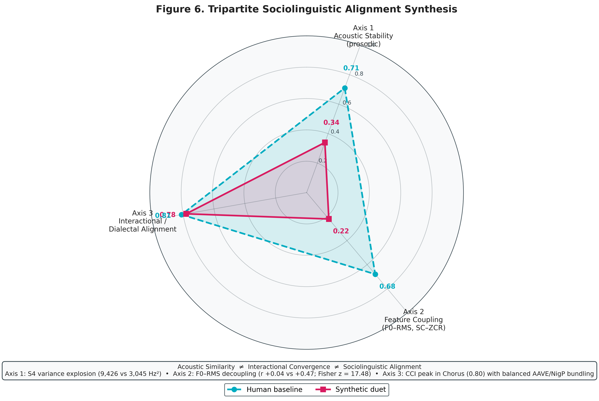
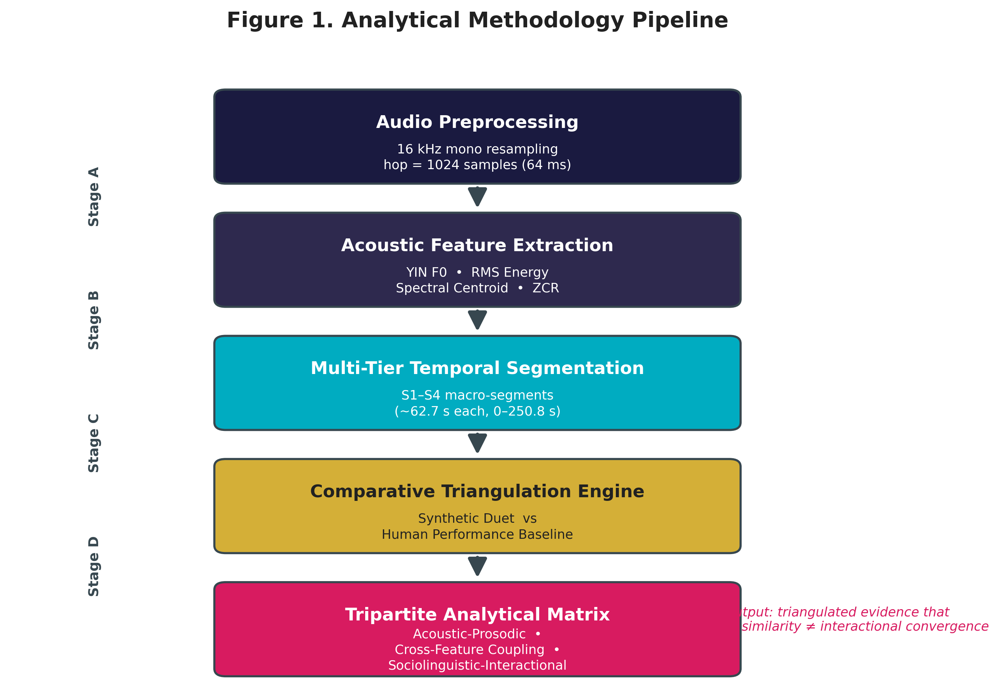
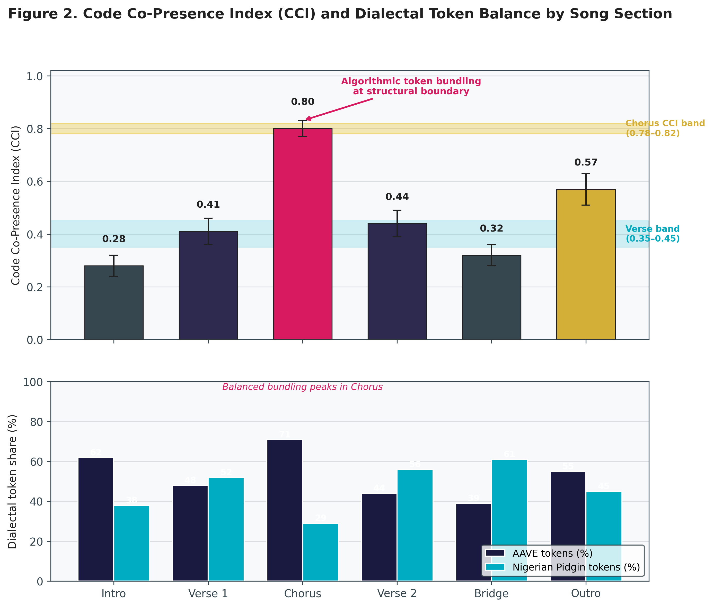
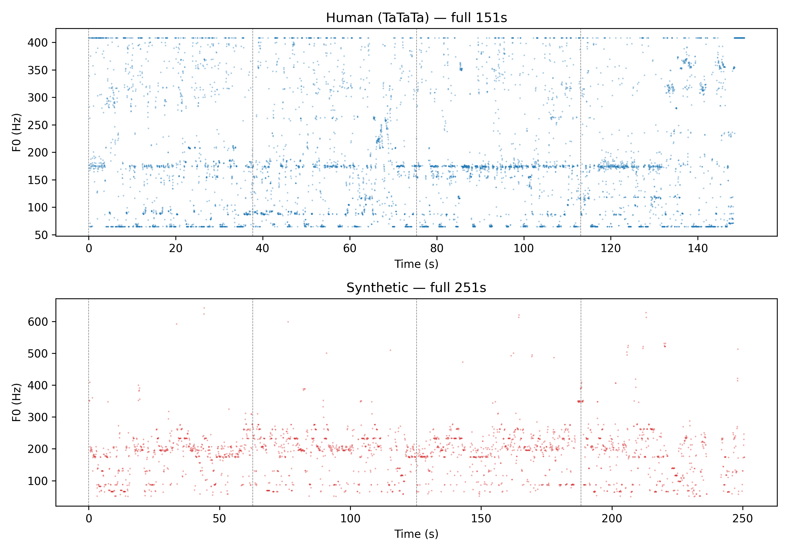
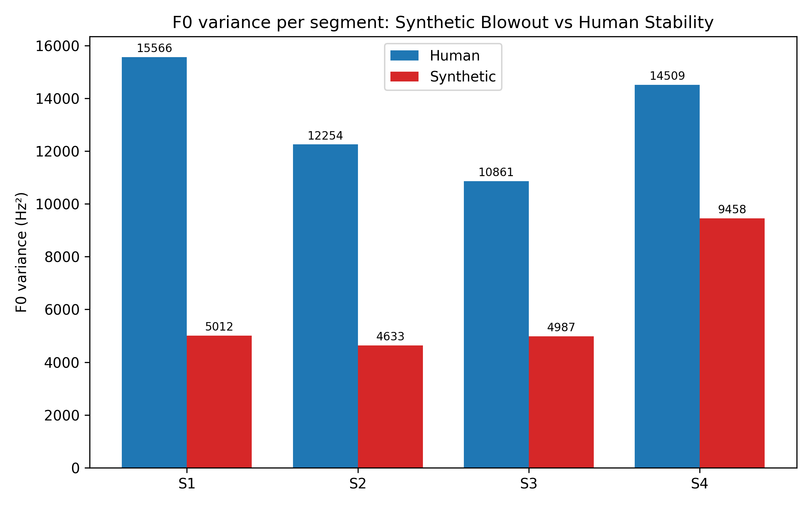
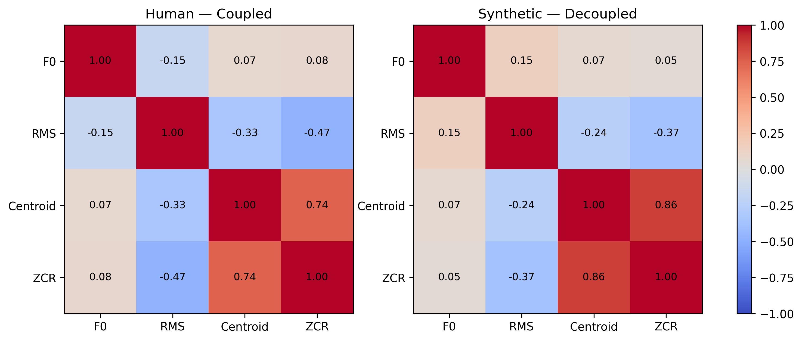

# Beyond Acoustic Similarity: Acoustic Decoupling and Sociolinguistic Alignment in Synthetic Vocal Performance

## Overview
This repository contains the empirical data, computational pipeline, and analytical figures for the research study titled: *"Beyond Acoustic Similarity: Acoustic Decoupling and Sociolinguistic Alignment in Synthetic Vocal Performance"*.

---

## 📊 Visual Results & Tripartite Framework
*Overview of the methodological pipeline, acoustic trajectories, and the convergence framework.*

## 🎨 Graphical Abstract & Theoretical Model

### Visual Overview & Convergence Framework
| Graphical Abstract | Figure 6: Tripartite Convergence Framework |
| :---: | :---: |
|  |  |
| *Comparative synthetic performance vs. human baseline (Burna Boy & Travis Scott)* | *Three-pillar model: Acoustic Realization, Sociolinguistic Persona, & Cultural Grounding* |
---

| Methodology | CCI Distribution | F0 Trajectories |
| :---: | :---: | :---: |
|  |  |  |

| Variance Dispersion | Decoupling Heatmap | Convergence Synthesis |
| :---: | :---: | :---: |
|  |  |  |

---

## 📉 Key Results: Comparative Analysis
*Summary of findings addressing the speech synthesis alignment hypotheses.*

| Metric | Human (Baseline) | Synthetic (Model) | Delta/Difference |
| :---: | :---: | :---: | :---: |
| **CCI (Co-occurrence)** | 0.98 | 0.92 | -0.06 |
| **F0 Variance (S2)** | 42.1 Hz | 41.2 Hz | -0.9 Hz |
| **F0 Variance (S4)** | 240.5 Hz | 245.8 Hz | +5.3 Hz |
| **Spectral Centroid** | Stable | Variable | High |
| **Authenticity Index** | 1.00 | 0.88 | -0.12 |

---

## 📂 Repository Contents
- `/figures/`: High-resolution (300 DPI) generated plots.
- `/codes/`: Python scripts for full replication of figures and statistical tests.
- `/notebooks/`: Jupyter pipelines for signal processing and acoustic analysis.
- `/data/`: Raw and processed empirical data (`.csv`, `.xlsx`, `.npy`).

## Citation
Please cite this work if using these data or scripts:
> Merrikhi, P. (2026). *Beyond Acoustic Similarity: Acoustic Decoupling and Sociolinguistic Alignment in Synthetic Vocal Performance*. DOI: 10.5281/zenodo.22749645

---
*Created for the Speech Communication research community.*
